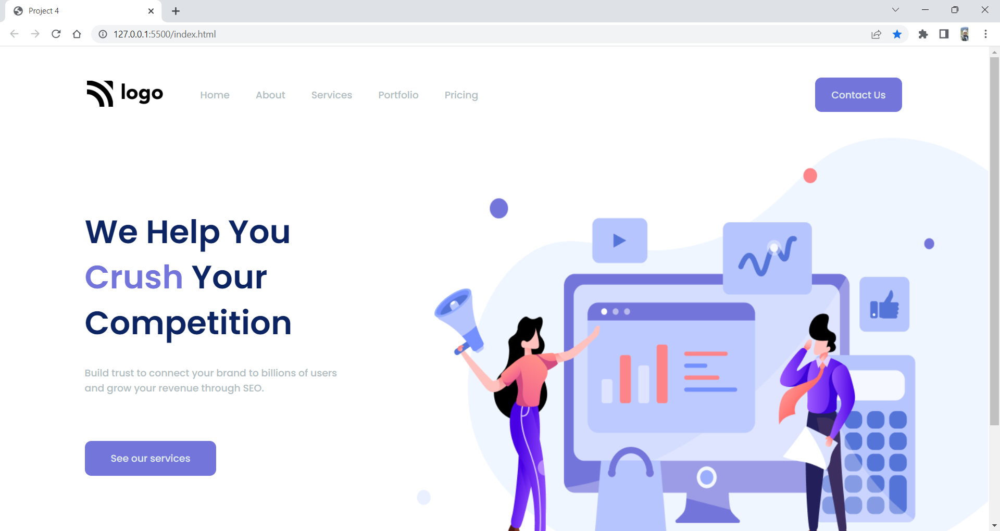

# Project 4: Digital Marketing Homepage

   

### Name:

> `Anshul Ghogre`

## Key Learnings from the project

- _Explored more flexbox properties._
- _Understood,that you can target diffrent inline tags seperately._

---

### Screenshots:-

---

> Time taken to complete this project: 4hrs

---

## [Live-Link](https://project-3-law-home-page1.netlify.app/)

---
